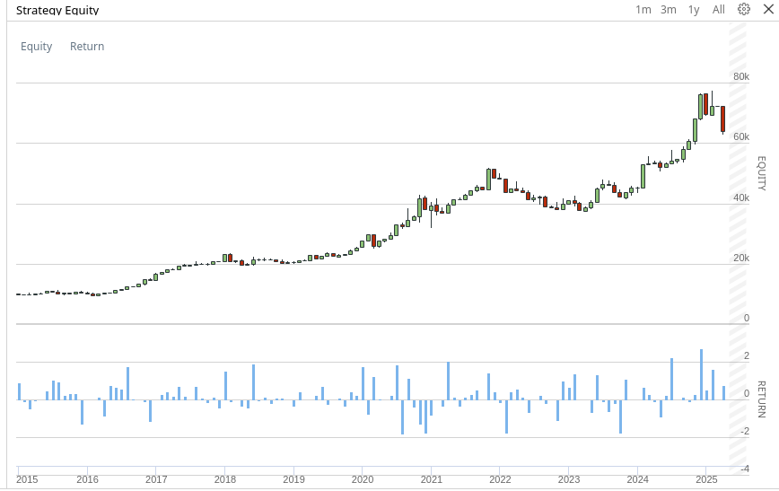

# 📈 SupertrendV2 Trading Strategy

SupertrendV2 is an algorithmic trading strategy based on the Supertrend indicator that uses the momentum of selected stock indices to generate buy and sell signals. The strategy is designed for the QuantConnect platform and allows for flexible configuration based on index type, breakout period length, and benchmark filter usage.

**Prerequisites**
* Liquidity
* Volatility
* Trending market with strong momemntum

> *Backtest Period: Jan 2015 – May 2025*  
> *(Using S&P500 MOMENTUM index medium-term breakout*

### CAGR 
The compound annual growth rate is the rate of return that an investment would need to have every year 
in order to grow from its beginning balance to its ending balance, over a given time interval.

| Stocks    | Benchmark ETF | Momentum ETF | Stock-index-top-10   |
|-----------|---------------|--------------|----------------------|
| LargeCap  | 16.52%        | 22.23%       | 33.5%  			  |

### Max drawdown
Maximum drawdown is the worst dip an investment takes from a high to a low. 
Maximum drawdown is an indicator of downside risk over a specified time period 
and highlights the potential volatility of a stock.

| Stocks    | Benchmark ETF | Momentum ETF | Stock-index-top-10   |
|-----------|---------------|--------------|----------------------|
| LargeCap  | 35%           | 32%          | 30.7%				  |

> * Backtest Period: Jan 2020 – May 2025
> * Super-trend medium term breakout with filter

## 🚀 Key Features

- **Multiple Index Support**: SP500, NASDAQ100, IPOX 100 US, and other momentum-based indices.
- **Supertrend breakout logic**: Three breakout levels – short-term, medium-term, and long-term – defined using ATR period and factor.
- **Dynamic stock selection**: The strategy automatically loads stocks based on the selected index.
- **Benchmark Filter**: Optional filter that only activates trades when the benchmark is above its 200-day SMA.
- **Leverage**: Option to set leverage for more aggressive capital allocation.

## ⚙️ Parameters

| Parameter | Description |
|-----|-------------------------------------------------------------------------|
| `index` | Index selection (e.g. `"SP500 MOMENTUM"`, `"NASDAQ100"`) |
| `breakout` | Breakout strategy type (`"LONG_TERM"`, `"MEDIUM_TERM"`, `"SHORT_TERM"`)|
| `leverage` | Leverage (e.g. `0`, `1`, `2`) |
| `enable_filter` | Benchmark filter activation (`"True"` or `"False"`) |
## 📊 Strategy Logic

1. **Initialization**:
- Loading historical data and indicators.
- Calculation of the Supertrend value for each stock.
- Calculation of the 200-day SMA benchmark.

2. **Trading Decision**:
- **Buy**: If the price is above the Supertrend, the benchmark is above SMA200 (if the filter is active) and the position is not open.
- **Sell**: If the price falls below the Supertrend or the benchmark is not above SMA200.

3. **Capital Allocation**:
- Even distribution between selected stocks with the possibility of increasing using leverage.

## 📁 Data Source

- Stocks are selected according to the ETF composition available on Yahoo Finance (e.g. [SPMO](https://finance.yahoo.com/quote/SPMO/holdings/)).

## 🧠 Supertrend Indicator

Supertrend is a trend indicator based on ATR (Average True Range) that helps identify the market direction. In this strategy it is used for breakout logic with different sensitivity factors.

## Resources
* [Supertrend Indicator: What It Is, How It Works - investopedia.com](https://www.investopedia.com/supertrend-indicator-7976167)
* [SuperTrend Indicator: A Comprehensive Guide - trendspider.com](https://trendspider.com/learning-center/supertrend-indicator-a-comprehensive-guide/)
* [Supertrend Indicator: Trading Strategy and Best Settings - howtotrade.com](https://howtotrade.com/indicators/supertrend/)